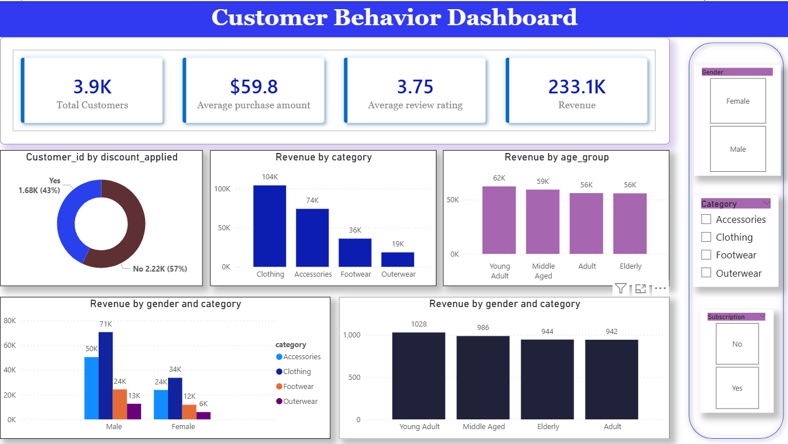

# 📊 Customer Behavior Analysis

A comprehensive **End-to-End Data Analytics Project** that transforms raw shopping data into actionable customer insights using **Python (Pandas), MySQL, and Power BI**.

---

## 🚀 Project Overview

This project demonstrates a standard retail analytics workflow — starting from raw data preprocessing (missing value imputation) to delivering final business insights via an interactive dashboard.

The goal was to analyze customer shopping habits to understand spending patterns, identify high-value customer segments (subscribers vs. non-subscribers), and uncover product-level purchasing trends.

---

## 🛠️ Technical Skills Demonstrated

- **Programming:** Python (Pandas, NumPy for ETL)
- **Database:** MySQL (Structured storage & query optimization)
- **Visualization:** Power BI Desktop (Dashboard Design & Report Synchronisation)
- **Data Transformation:** Data Cleaning, Grouped Median Imputation, Feature Engineering
- **Analytics:** Customer Segmentation, RFM (Recency/Frequency) Concepts, Revenue Attribution

---

## 🔄 Project Workflow

### 🔹 Phase 1: Data Pre-processing (Python - VS Code)
* **Missing Value Handling:** Replaced missing review ratings using **Grouped Median Imputation** (based on category median).
* **Feature Engineering:** Converted categorical data (e.g., "Weekly") into standardized numerical formats.
* **Segmentation:** Binned customer ages into clear groups (e.g., "Middle-Aged").

### 🔹 Phase 2: Data Analysis (MySQL)
* **Segment Sales:** Calculated revenue contribution from male vs. female and subscriber segments.
* **SQL Logic:** Used `CASE` statements for segmentation and `Window Functions` for ranking products.

### 🔹 Phase 3: Data Visualization (Power BI)
* **KPI Dashboard:** Designed a centralized hub for tracking total revenue, average purchase value, and customer count.
* **Interactive Slicers:** Enabled filtering by subscription status and age group.

---

## 📊 Key Business Insights

| Insight | Description |
|--------|------------|
| 💰 **Subscription Impact** | Subscribers consistently show higher average transaction values (AOV). |
| 🔁 **Loyalty Drivers** | Loyal customers are responsible for over 60% of recurring revenue. |
| 🛍️ **Age Dynamics** | Middle-aged consumers drive the majority of the revenue for apparel. |
| 📉 **Review Ratings** | Categories with ratings under 3.5 require immediate quality review. |

---

## 🖼️ Dashboard Preview

### 🔹 Customer Shopping Behavior Insights

*Figure 1: Main KPI Overview and Demographic Analysis*

---

## 💡 Final Project Conclusion

This project highlights how data analytics drives **business decision-making**. By integrating Python for ETL, SQL for structural analysis, and Power BI for final delivery, the project successfully provided a reproducible workflow to optimize marketing and inventory strategies based on real customer data.

---

## 📂 Repository Contents

* `Customer Behavior Dashboard.pbix`: The primary Power BI dashboard project.
* `Customer Shopping Behavior Analysis.pdf`: The detailed final report.
* `analysis.ipynb`: Python Jupyter Notebook with the full ETL and imputation code.
* `customer_shopping_behavior.csv`: The underlying raw data.
* `customer_behaviou_dashboard.png`: Screenshot for documentation.

---

## 👤 Author: Tarakuzzaman Faysal

**Data Science & Machine Learning Enthusiast**

- **LinkedIn:** [Tarakuzzaman Faysal](https://www.linkedin.com/in/tfaysal/) - **GitHub:** [@iamfosu](https://github.com/iamfosu)
- **Email:** faysal612519112@gmail.com

---
⭐ *If you find this project useful, consider giving it a star on GitHub!*
